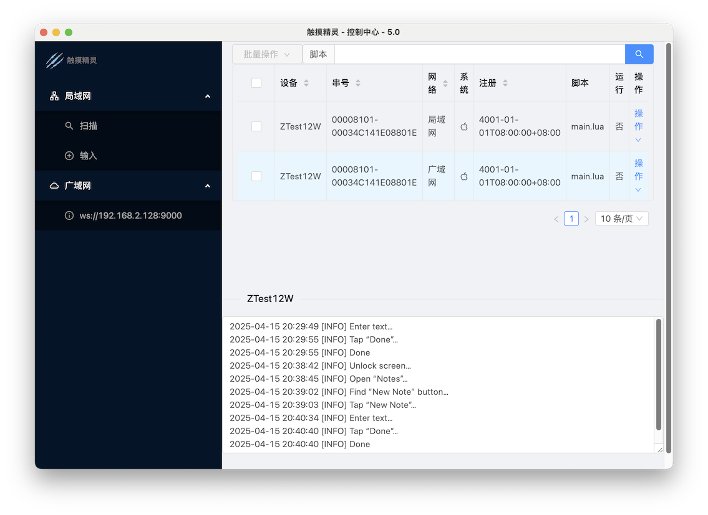

# Cloud Control API

The XXTouch Elite Cloud Control API is developed using the WebSocket protocol, with a built-in cloud control client called `elfclient`.

We also provide a cloud control server example [XXTouch-CloudControl](https://github.com/XXTouchNG/XXTouch-CloudControl), which you can customize according to your business needs.



You need to [configure the cloud control server address](https://elite.82flex.com/api-283425169) for the `elfclient` client.
Once the client successfully connects to the WebSocket server, the server can communicate with the device following the specifications below.

## Specification

### Request

```json
{
  "type": "Message Type",
  "body": "Message Data"
}
```

### Response

```json
{
  "type": "Message Type",
  "body": "Message Data",
  "error": "Empty if successful, error message if failed"
}
```

:::note
If `body` contains binary data, it is transmitted using Base64 encoding.
:::

### Heartbeat

After the client connects, the server should periodically send `ping` to the client at intervals not exceeding 30 seconds (default is 5 seconds).
If the client does not receive a `ping` for more than 30 seconds, it will automatically disconnect and attempt to reconnect.

## Server Example Code

```js
import WebSocket from 'ws'

const wss = new WebSocket.Server({ port: 9000 })

wss.on('connection', (ws) => {
  ws.on('message', (data) => {
    const json = JSON.parse(data)
    if (json.error) {
      console.log('Error:' + json.error)
    } else {
      console.log(json.body)
    }
  })

  setInterval(() => {
    ws.ping(() => {})
  }, 5000)

  ws.send(
    JSON.stringify({
      type: 'app/state',
    }),
  )
})
```

## Service-Related

### Get Service Status

```json
{
  "type": "app/state"
}
```

```json
{
  "type": "app/state",
  "error": "",
  "body": {
    "app": {
      "version": "Service Version",
      "license": "Expiration Date"
    },
    "script": {
      "select": "Currently Selected Script",
      "running": "Is Running"
    },
    "system": {
      "os": "ios",
      "name": "Device Name",
      "sn": "Device Serial Number",
      "ip": "Device IP Address",
      "battery": "Device Battery Level",
      "log": "Last Log Entry"
    }
  }
}
```

### Activate License Code

```json
{
  "type": "app/register",
  "body": {
    "code": "12/16-digit Registration Code"
  }
}
```

```json
{
  "type": "app/register",
  "error": ""
}
```

## Script-Related

### Get Script List

```json
{
  "type": "script/list"
}
```

```json
{
  "type": "script/list",
  "error": "",
  "body": ["Script1", "Script2"]
}
```

### Run Script

```json
{
  "type": "script/run",
  "body": {
    "name": "a.lua"
  }
}
```

```json
{
  "type": "script/run",
  "error": ""
}
```

### Stop Script

```json
{
  "type": "script/stop"
}
```

```json
{
  "type": "script/stop",
  "error": ""
}
```

### Encrypt Script

```json
{
  "type": "script/encrypt",
  "body": {
    "name": "a.lua"
  }
}
```

```json
{
  "type": "script/encrypt",
  "error": ""
}
```

### Get Script

```json
{
  "type": "script/get",
  "body": {
    "name": "a.lua"
  }
}
```

```json
{
  "type": "script/get",
  "error": "",
  "body": "Base64-encoded Script Content"
}
```

### Update Script

```json
{
  "type": "script/put",
  "body": {
    "name": "a.lua",
    "data": "Base64-encoded Script Content"
  }
}
```

```json
{
  "type": "script/put",
  "error": ""
}
```

### Delete Script

```json
{
  "type": "script/delete",
  "body": {
    "name": "a.lua"
  }
}
```

```json
{
  "type": "script/delete",
  "error": ""
}
```

## System-Related

### Get Logs

```json
{
  "type": "system/log/get",
  "body": {
    "last": 5
  }
}
```

```json
{
  "type": "system/log/get",
  "error": "",
  "body": "Logs"
}
```

### Delete Logs

```json
{
  "type": "system/log/delete"
}
```

```json
{
  "type": "system/log/delete",
  "error": ""
}
```

### Reboot Device

```json
{
  "type": "system/reboot"
}
```

```json
{
  "type": "system/reboot",
  "error": ""
}
```

### Respring Device

```json
{
  "type": "system/respring"
}
```

```json
{
  "type": "system/respring",
  "error": ""
}
```

## Screen-Related

### Get Screenshot

```json
{
  "type": "screen/snapshot",
  "body": {
    "format": "png",
    "scale": 100
  }
}
```

```json
{
  "type": "screen/snapshot",
  "error": "",
  "body": "Base64-encoded Screenshot Data"
}
```

## Touch-Related

### Finger Down

```json
{
  "type": "touch/down",
  "body": {
    "finger": 1,
    "x": 100,
    "y": 100
  }
}
```

```json
{
  "type": "touch/down",
  "error": ""
}
```

### Finger Move

```json
{
  "type": "touch/move",
  "body": {
    "finger": 1,
    "x": 100,
    "y": 100
  }
}
```

```json
{
  "type": "touch/move",
  "error": ""
}
```

### Finger Up

```json
{
  "type": "touch/up",
  "body": {
    "finger": 1
  }
}
```

```json
{
  "type": "touch/up",
  "error": ""
}
```

## Key-Related

- [Supported Key Codes List](../appendix/supported-keycodes.md)

### Key Down

```json
{
  "type": "key/down",
  "body": {
    "code": "HOMEBUTTON",
  }
}
```

```json
{
  "type": "key/down",
  "error": ""
}
```

### Key Up

```json
{
  "type": "key/up",
  "body": {
    "code": "HOMEBUTTON",
  }
}
```

```json
{
  "type": "key/up",
  "error": ""
}
```

## File-Related

All APIs in this section must provide a `path` parameter, with the value starting from the `/var/mobile/Media/1ferver` directory.

### File List

```json
{
  "type": "file/list",
  "body": {
    "path": "/lua/scripts"
  }
}
```

```json
{
  "type": "file/list",
  "error": "",
  "body": [
    { "name": "a", "type": "dir" },
    { "name": "b", "type": "file" }
  ]
}
```

### Download File

```json
{
  "type": "file/get",
  "body": {
    "path": "/lua/scripts/a.dat"
  }
}
```

```json
{
  "type": "file/get",
  "error": "",
  "body": "Base64-encoded File Content"
}
```

### Upload File

```json
{
  "type": "file/put",
  "body": {
    "path": "/lua/scripts/a.dat",
    "data": "Base64-encoded File Content"
  }
}
```

```json
{
  "type": "file/put",
  "error": ""
}
```

### Create Directory

```json
{
  "type": "file/put",
  "body": {
    "path": "/dir",
    "directory": true
  }
}
```

```json
{
  "type": "file/put",
  "error": "",
  "body": {
    "directory": true
  }
}
```

### Delete File or Directory

```json
{
  "type": "file/delete",
  "body": {
    "path": "/scripts/a.lua"
  }
}
```

```json
{
  "type": "file/delete",
  "error": ""
}
```
