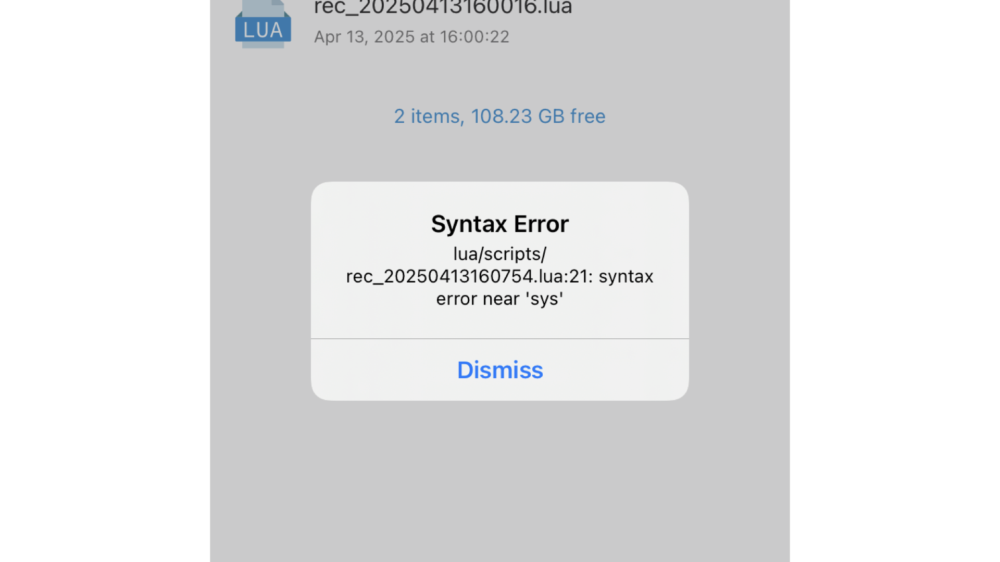

# Error Handling

XXTouch Elite follows [Lua Error Handling](https://cloudwu.github.io/lua53doc/manual.html#2.3) and outputs error messages and stack trace information to the log file `/var/mobile/Media/1ferver/log/script_error.log`. You can view this file in **X.X.T.E. Application** → **More** → **Error Logs**. If the error is not caught, an error prompt will pop up.

You can explicitly throw an error in Lua code by calling the [error](https://cloudwu.github.io/lua53doc/manual.html#pdf-error) function. If you need to catch these errors in Lua, you can use [pcall](https://cloudwu.github.io/lua53doc/manual.html#pdf-pcall) or [xpcall](https://cloudwu.github.io/lua53doc/manual.html#pdf-xpcall) to call a function in **protected mode**.
