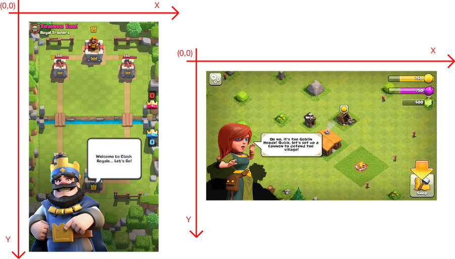

# Screen Coordinates

Please first turn off the **screen orientation lock** on your device, keep the earpiece at the top, and hold the device **vertically**. The coordinate system is shown in the following figure `Hardware Coordinates`:

XXTouch Elite always uses physical pixels as units, with the hardware resolution coordinate system, rather than the logical resolution coordinate system or the view coordinate system. For information about coordinate systems on different devices, please refer to:

- [iOS Resolution](https://www.ios-resolution.com/)
- [iOS Design Cheat Sheet](https://kapeli.com/cheat_sheets/iOS_Design.docset/Contents/Resources/Documents/index)
- [The Ultimate Guide To iPhone Resolutions](https://www.paintcodeapp.com/news/ultimate-guide-to-iphone-resolutions)

:::tip
In your script, you can change the screen coordinate system using the [`screen.init`](../screen.md#initialize-rotated-coordinate-system-screeninit) function.

:::
