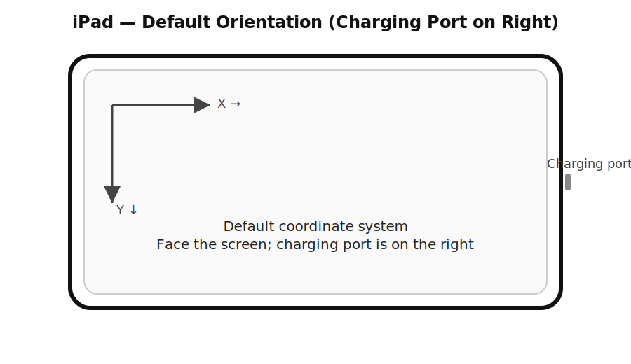

# Screen Coordinates

Please first turn off the **screen orientation lock** on your device, keep the earpiece at the top, and hold the device **vertically**. The coordinate system is shown in the following figure `Hardware Coordinates`:

XXTouch Elite always uses physical pixels as units, with the hardware resolution coordinate system, rather than the logical resolution coordinate system or the view coordinate system. For information about coordinate systems on different devices, please refer to:

- [iOS Resolution](https://www.ios-resolution.com/)
- [iOS Design Cheat Sheet](https://kapeli.com/cheat_sheets/iOS_Design.docset/Contents/Resources/Documents/index)
- [The Ultimate Guide To iPhone Resolutions](https://www.paintcodeapp.com/news/ultimate-guide-to-iphone-resolutions)

## Device default orientation and affected modules

This chapter uses the hardware coordinate system (physical pixels). In addition, XXTouch Elite defines device-specific default orientations that affect how coordinates are interpreted by common features.

### Default orientations

For historical reasons, any mention in this manual of “HOME button at the bottom” should be read as the device’s default orientation; likewise, mentions of the HOME button being left/right/top correspond to the respective orientation conventions.

iPhone: Portrait (upright). This is the default orientation for screenshots, simulated taps, record-and-replay, and Script UI.

iPad: Facing the screen, the default orientation is with the charging port on the right side (Landscape Right).

### What this impacts

- Screen-related operations: capturing screenshots, cropping regions, color sampling, and image recognition all interpret X/Y in the default orientation unless you change it.
- Touch interactions: coordinates for tapping, swiping, and other gestures; recorded tracks are played back under the default orientation.
- Record and replay: gesture paths are stored in hardware coordinates and assumed to run under the default orientation unless reconfigured.
- Script UI and overlays: any absolute screen positions used by UI/overlay components follow the same orientation rules.
- Image/template reuse: templates/screenshots created under one orientation should be used under the same orientation, or you should rotate/normalize via `screen.init`.

### Changing the coordinate system in scripts

When needed, use [`screen.init`](../screen.md#initialize-rotated-coordinate-system-screeninit) to rotate the working coordinate system for your script, while XXTouch Elite still operates on hardware pixels underneath. It’s good practice to explicitly set your intended orientation at the start of a script.

