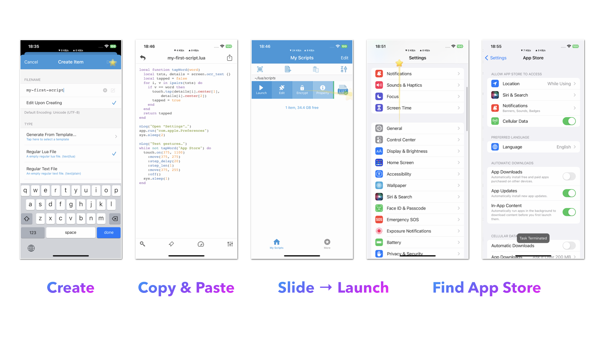

# Create a Script

Playing recorded scripts is great, but it is unlikely to respond to all the possible situations that can occur in a real-world scenario. For this reason, it is important to create a script that can handle different situations.

Now we’ve written a script for you that will help you get started. This script will open the “Settings”, scroll down to find “App Store” option, and click on it.

```lua
local function tapWord(word)
  local txts, details = screen.ocr_text {}
  local tapped = false
  for i, v in ipairs(txts) do
    if v == word then
      touch.tap(details[i].center[1], details[i].center[2])
      tapped = true
    end
  end
  return tapped
end

nLog("Open “Settings”…")
app.run("com.apple.Preferences")
sys.sleep(2)

nLog("Test gestures…")
while not tapWord("App Store") do
  touch.on(375, 1100)
    :move(375, 275)
    :step_delay(20)
    :step_len(1)
    :move(375, 255)
    :off()
  sys.sleep(1)
end
```

## Find App Store

You can follow the steps below to run the script above:

1. Create a new lua script file named `my-first-script.lua`.
2. Copy the code below and paste it into the file, and save it.
3. Slide the script to the right and click the “Launch” button.


