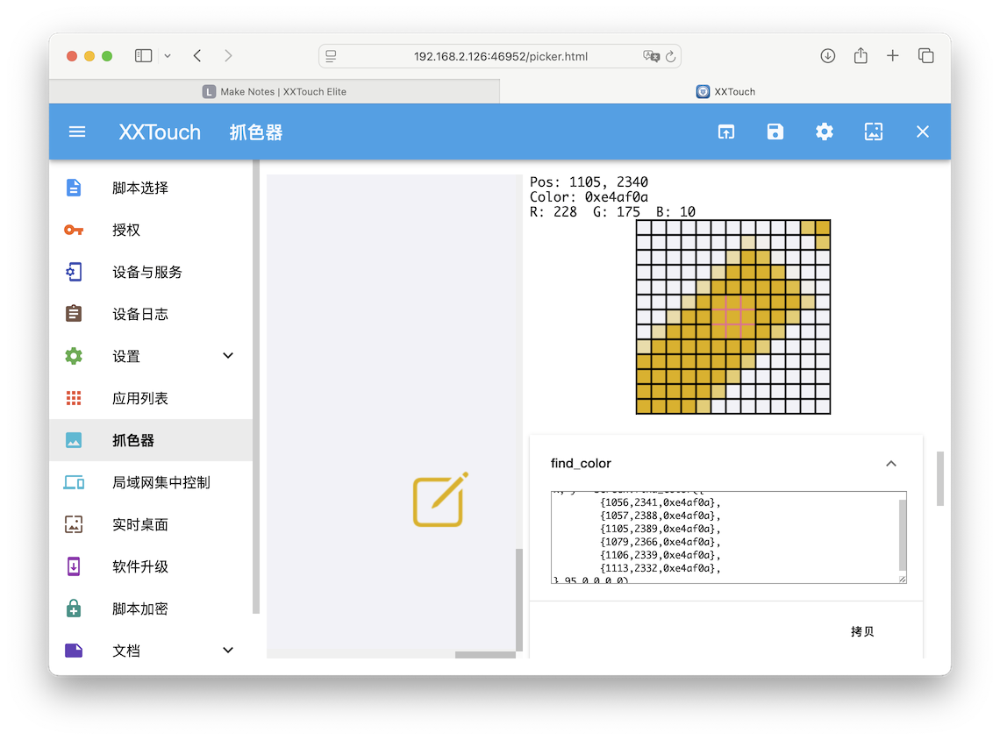

# Make Some Notes

Now we are ready to start developing scripts. You can use the web interface to create and edit scripts, as well as test them in real-time.

In this tutorial, we will create a simple script that opens “Notes” on your device, creates a new note, and writes the most famous sentence in the developer community: `Hello, World!`.

## Create a New Script

Let’s start by creating a new script. Click on the “New Script” button on the top-right corner of the page. Enter a name for your script, e.g. `my-awesome-script.lua`.


## Open “Notes”

The first thing we need to do is to open the “Notes” app. To do this, we will use the [`app.run`](../lua-manual/app.md#run-the-app-apprun) function. The [`app.run`](../lua-manual/app.md#run-the-app-apprun) function takes a string as an argument, which is the bundle identifier of the app we want to open. In our case, we want to open the “Notes” app, so we will use the string `"com.apple.mobilenotes"`.

```lua
nLog("Open Notes...")
app.run("com.apple.mobilenotes")
```

Note that the [`nLog`](../appendix/logging-facilities.md#nlog) function is used to log messages to the console. This is useful for debugging and testing your scripts.

Click “Play” button at the bottom-right corner of the page to run the script. You should see the “Notes” app open on your device.


:::info
Find the bundle identifier of an app from “More” → “Application List” in “X.X.T.E.” app.
:::

## Find “New Note” Button

Now that we have opened the “Notes” app, we need to find the “New Note” button. To do this, we will use the [`screen.find_color`](../lua-manual/screen.md#-multi-point-similarity-mode-color-finding-screenfind_color) function. The [`screen.find_color`](../lua-manual/screen.md#-multi-point-similarity-mode-color-finding-screenfind_color) function takes a color table as an argument, which is the collection of the color samples we want to find.


Open “Color Picker” in the sidebar, locate the “New Note” button, and click on it. This will add the color sample to the color table. You have to add more color samples to increase the possibility of finding the button.



Copy generated code from `find_color` function and paste it into your script:

```lua
local x, y
while x == nil do
    nLog("Find “New Note” button…")
    sys.sleep(1)
    -- Generated code
    x, y = screen.find_color({
        {1056,2341,0xe4af0a},
        {1057,2388,0xe4af0a},
        {1105,2389,0xe4af0a},
        {1079,2366,0xe4af0a},
        {1106,2339,0xe4af0a},
        {1113,2332,0xe4af0a},
    },95,0,0,0,0)
end

nLog("Tap “New Note”…")
touch.tap(x, y)
sys.sleep(2)
```

Here we’ve added 6 color samples to the color table. Use `while ... do` loop to keep searching for the button until it is found. The [`sys.sleep(1)`](../lua-manual/sys.md#-second-level-delay-syssleep) function is used to pause the script for 1 second before searching again.

The [`screen.find_color`](../lua-manual/screen.md#-multi-point-similarity-mode-color-finding-screenfind_color) function returns the coordinates of the button if it is found, or `nil` if it is not found. We will use these coordinates with [`touch.tap`](../lua-manual/touch.md#simulate-a-single-tap-on-the-screen-touchtap) to click on the button.

:::tip
Making color samples is not an easy task. Here are some practical tips:

1. **Select different colors**. Different colors make the search more unique.
2. **Avoid graph edges**. Due to the anti-aliasing effect, the colors on the edges vary a lot.
3. **Stay spread out**. The sampled points should be spread out to cover more space in the area that you want to locate.

:::

## Enter “Hello, World!”

Sending text to the “Notes” app is the most straightforward part. We can use the [`key.send_text`](../lua-manual/key.md#simulate-typing-text-keysend_text) function to send text to the app. The [`key.send_text`](../lua-manual/key.md#simulate-typing-text-keysend_text) function takes a string as an argument, which is the text we want to send.

```lua
nLog("Enter text…")
key.send_text("Hello, world!")
```

Click “Play” button at the bottom-right corner of the page to run the script.


## Tap “Done”

Finally, we need to tap the “Done” button to save the note. We can use the [`screen.ocr_text`](../lua-manual/screen.md#-screen-optical-character-recognition-screenocr_text) function to find the “Done” button and then use [`touch.tap`](../lua-manual/touch.md#simulate-a-single-tap-on-the-screen-touchtap) to click on it. This part is a bit tricky because texts are easily affected by the font and size, so we need to use OCR (Optical Character Recognition) to find it.

**Here is our final script:**

```lua
nLog("Open “Notes”…")
app.run("com.apple.mobilenotes")

local x, y
while x == nil do
    nLog("Find “New Note” button…")
    sys.sleep(1)
    x, y = screen.find_color({
        {1056,2341,0xe4af0a},
        {1057,2388,0xe4af0a},
        {1105,2389,0xe4af0a},
        {1079,2366,0xe4af0a},
        {1106,2339,0xe4af0a},
        {1113,2332,0xe4af0a},
    },95,0,0,0,0)
end

nLog("Tap “New Note”…")
touch.tap(x, y)

nLog("Enter text…")
sys.sleep(2)
key.send_text("Hello, world!")

local function tapWord(word)
  local txts, details = screen.ocr_text {}
  local tapped = false
  for i, v in ipairs(txts) do
    if v == word then
      touch.tap(details[i].center[1], details[i].center[2])
      tapped = true
    end
  end
  return tapped
end

nLog("Tap “Done”…")
while not tapWord("Done") do
    sys.sleep(1)
end
```
