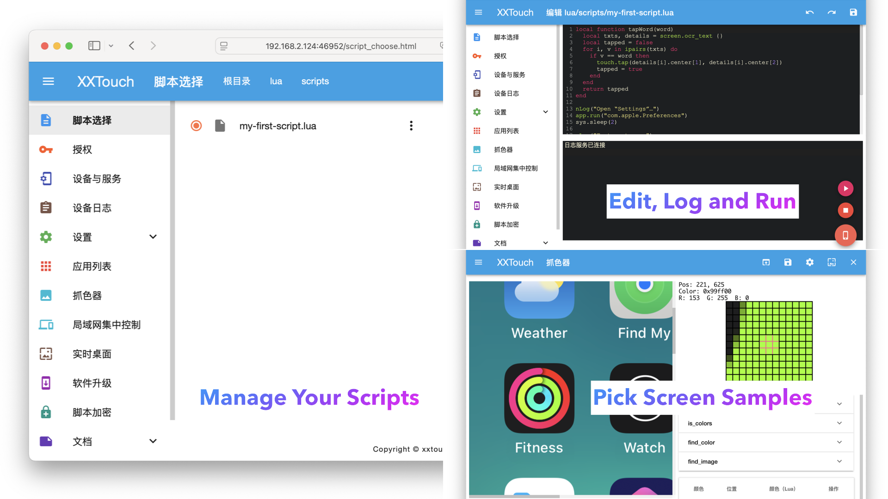

# Ready to Develop

To get started with script development, you need to have a laptop or desktop computer with Safari or Chrome installed.

## Enable Remote Access

To protect your device from unauthorized access, you need to enable remote access in the “X.X.T.E.” app.


## Access from Web Browser

Then you can access your scripts from your web browser by entering the following URL:

```txt
http://<ip_address>:46952
```

Where `<ip_address>` is the IP address of your device and `46952` is the default port number of XXTouch Elite.


