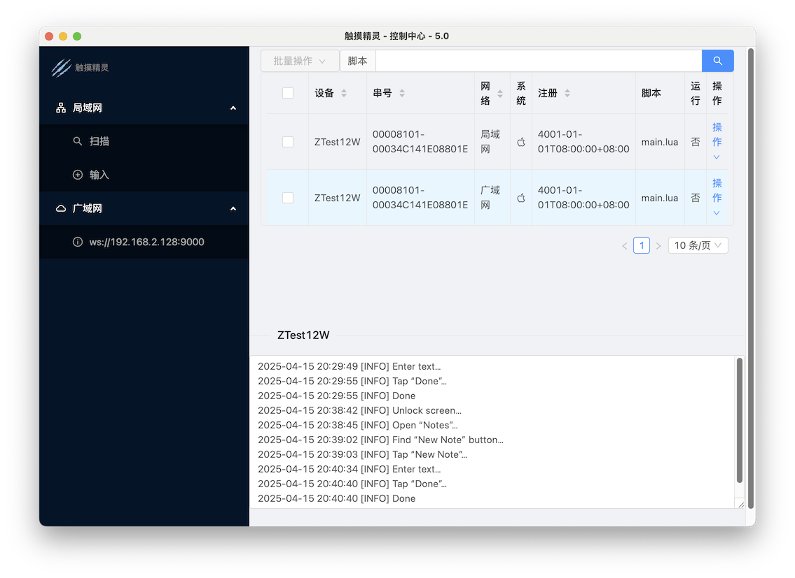

# 云控 API

XXTouch Elite 云控 API 以 WebSocket 协议开发，内建的云控客户端为 `elfclient`。

我们还提供了云控服务端例程 [XXTouch-CloudControl](https://github.com/XXTouchNG/XXTouch-CloudControl)，你可以根据自己的业务需要进行二次开发。



你需要为 `elfclient` 客户端 [配置云控服务端的地址](https://elite.82flex.com/api-283425169)。

当客户端成功连接到 WebSocket 服务端之后，服务端可以遵循以下规范和设备通信。

## 规范说明

### 请求规范

```json
{
  "type": "消息类型",
  "body": "消息数据"
}
```

### 响应规范

```json
{
  "type": "消息类型",
  "error": "成功时为空, 出错时为错误信息",
  "body": "消息数据"
}
```

> 注：`body` 中若有二进制数据, 则以 Base64 编码传输。

### 心跳规范

客户端连接后，服务器应定时发送 `ping` 至客户端，每次间隔不超过 30 秒（默认 5 秒）。

如果客户端超过 30 秒未收到 `ping`，将自动断开连接并尝试重连。

## 服务端示例代码

```js
import WebSocket from 'ws'

const wss = new WebSocket.Server({ port: 9000 })

wss.on('connection', (ws) => {
  ws.on('message', (data) => {
    const json = JSON.parse(data)
    if (json.error) {
      console.log('错误:' + json.error)
    } else {
      console.log(json.body)
    }
  })

  setInterval(() => {
    ws.ping(() => {})
  }, 5000)

  ws.send(
    JSON.stringify({
      type: 'app/state',
    }),
  )
})
```

## 服务相关

### 获取服务状态

```json
{
  "type": "app/state"
}
```

```json
{
  "type": "app/state",
  "error": "",
  "body": {
    "app": {
      "version": "服务版本号",
      "license": "到期时间"
    },
    "script": {
      "select": "当前选择脚本",
      "running": "是否运行中"
    },
    "system": {
      "os": "ios",
      "name": "设备名称",
      "sn": "设备串号",
      "ip": "设备IP地址",
      "battery": "设备电量",
      "log": "最后一条日志"
    }
  }
}
```

### 激活授权码

```json
{
  "type": "app/register",
  "body": {
    "code": "12/16位注册码"
  }
}
```

```json
{
  "type": "app/register",
  "error": ""
}
```

## 脚本相关

### 获取脚本列表

```json
{
  "type": "script/list"
}
```

```json
{
  "type": "script/list",
  "error": "",
  "body": ["脚本1", "脚本2"]
}
```

### 运行脚本

```json
{
  "type": "script/run",
  "body": {
    "name": "a.lua"
  }
}
```

```json
{
  "type": "script/run",
  "error": ""
}
```

### 停止脚本

```json
{
  "type": "script/stop"
}
```

```json
{
  "type": "script/stop",
  "error": ""
}
```

### 加密脚本

```json
{
  "type": "script/encrypt",
  "body": {
    "name": "a.lua"
  }
}
```

```json
{
  "type": "script/encrypt",
  "error": ""
}
```

### 获取脚本

```json
{
  "type": "script/get",
  "body": {
    "name": "a.lua"
  }
}
```

```json
{
  "type": "script/get",
  "error": "",
  "body": "Base64 编码的脚本内容"
}
```

### 更新脚本

```json
{
  "type": "script/put",
  "body": {
    "name": "a.lua",
    "data": "Base64 编码的脚本内容"
  }
}
```

```json
{
  "type": "script/put",
  "error": ""
}
```

### 删除脚本

```json
{
  "type": "script/delete",
  "body": {
    "name": "a.lua"
  }
}
```

```json
{
  "type": "script/delete",
  "error": ""
}
```

## 系统相关

### 获取日志

```json
{
  "type": "system/log/get",
  "body": {
    "last": 5
  }
}
```

```json
{
  "type": "system/log/get",
  "error": "",
  "body": "日志"
}
```

### 删除日志

```json
{
  "type": "system/log/delete"
}
```

```json
{
  "type": "system/log/delete",
  "error": ""
}
```

### 重启设备

```json
{
  "type": "system/reboot"
}
```

```json
{
  "type": "system/reboot",
  "error": ""
}
```

### 注销设备

```json
{
  "type": "system/respring"
}
```

```json
{
  "type": "system/respring",
  "error": ""
}
```

## 屏幕相关

### 获取截图

```json
{
  "type": "screen/snapshot",
  "body": {
    "format": "png",
    "scale": 100
  }
}
```

```json
{
  "type": "screen/snapshot",
  "error": "",
  "body": "Base64 编码的截图数据"
}
```

## 触摸相关

### 手指按下

```json
{
  "type": "touch/down",
  "body": {
    "finger": 1,
    "x": 100,
    "y": 100
  }
}
```

```json
{
  "type": "touch/down",
  "error": ""
}
```

### 手指移动

```json
{
  "type": "touch/move",
  "body": {
    "finger": 1,
    "x": 100,
    "y": 100
  }
}
```

```json
{
  "type": "touch/move",
  "error": ""
}
```

### 手指抬起

```json
{
  "type": "touch/up",
  "body": {
    "finger": 1
  }
}
```

```json
{
  "type": "touch/up",
  "error": ""
}
```

## 按键相关

- [支持的键码列表](supported-keycodes.md)

### 按键按下

```json
{
  "type": "key/down",
  "body": {
    "code": "HOMEBUTTON",
  }
}
```

```json
{
  "type": "key/down",
  "error": ""
}
```

### 按键抬起

```json
{
  "type": "key/up",
  "body": {
    "code": "HOMEBUTTON",
  }
}
```

```json
{
  "type": "key/up",
  "error": ""
}
```

## 文件相关

> 本节中的 API 都必须提供一个 `path` 参数， 值为从 `/var/mobile/Media/1ferver` 目录开始的文件路径。

### 文件列表

```json
{
  "type": "file/list",
  "body": {
    "path": "/lua/scripts"
  }
}
```

```json
{
  "type": "file/list",
  "error": "",
  "body": [
    { "name": "a", "type": "dir" },
    { "name": "b", "type": "file" }
  ]
}
```

### 下载文件

```json
{
  "type": "file/get",
  "body": {
    "path": "/lua/scripts/a.dat"
  }
}
```

```json
{
  "type": "file/get",
  "error": "",
  "body": "Base64 编码的文件内容"
}
```

### 上传文件

```json
{
  "type": "file/put",
  "body": {
    "path": "/lua/scripts/a.dat",
    "data": "Base64 编码的文件内容"
  }
}
```

```json
{
  "type": "file/put",
  "error": ""
}
```

### 创建目录

```json
{
  "type": "file/put",
  "body": {
    "path": "/dir",
    "directory": true
  }
}
```

```json
{
  "type": "file/put",
  "error": "",
  "body": {
    "directory": true
  }
}
```

### 删除文件或目录

```json
{
  "type": "file/delete",
  "body": {
    "path": "/scripts/a.lua"
  }
}
```

```json
{
  "type": "file/delete",
  "error": ""
}
```
