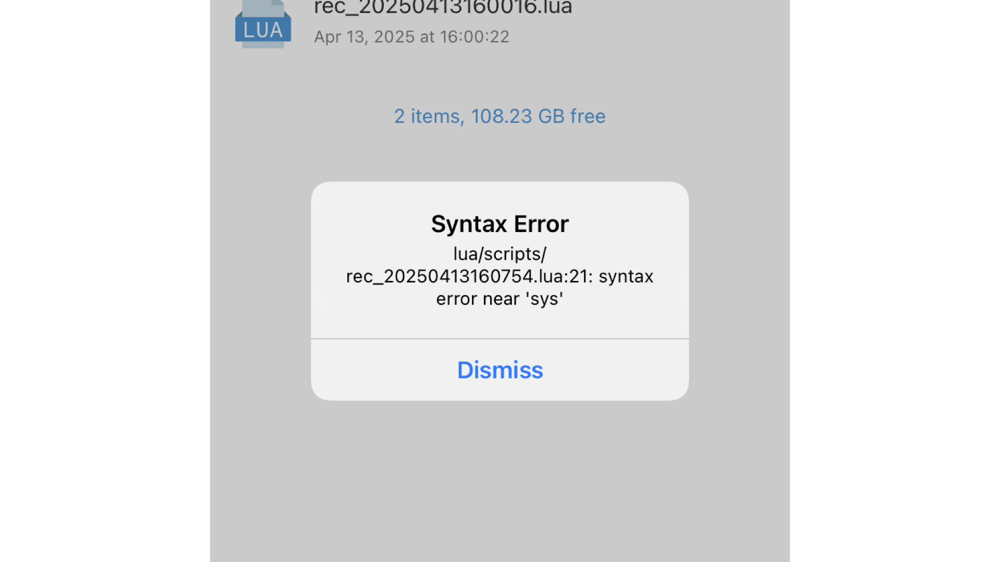

# 错误处理

XXTouch Elite 在遵循 [Lua 错误处理](https://cloudwu.github.io/lua53doc/manual.html#2.3) 的同时，还会将错误信息及堆栈信息输出到日志文件 `/var/mobile/Media/1ferver/log/script_error.log`，你可以在 **X.X.T. 应用程序** -> **更多** -> **错误日志** 中查看该文件。如果错误未被捕获，将会弹出一个错误提示框。

可以在 Lua 代码中调用 [error](https://cloudwu.github.io/lua53doc/manual.html#pdf-error) 函数来显式地抛出一个错误。如果你需要在 Lua 中捕获这些错误，可以使用 [pcall](https://cloudwu.github.io/lua53doc/manual.html#pdf-pcall) 或 [xpcall](https://cloudwu.github.io/lua53doc/manual.html#pdf-xpcall) 在 **保护模式** 下调用一个函数。
