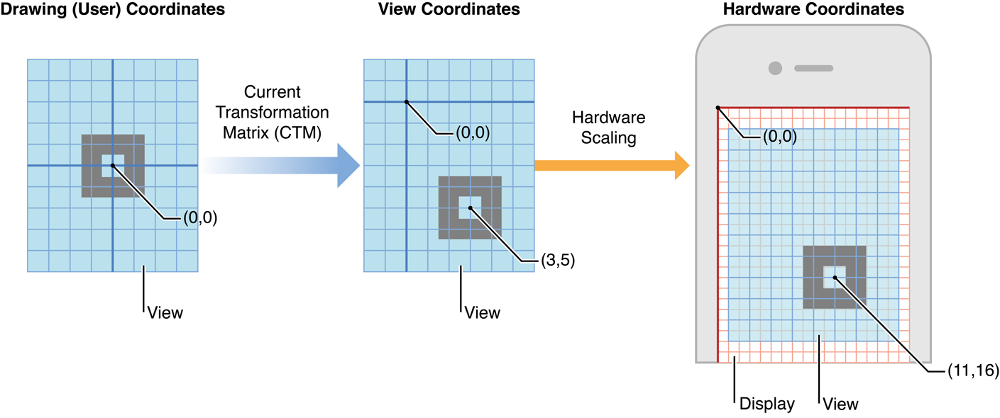
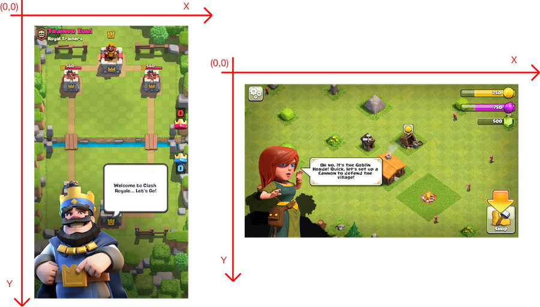

# 屏幕坐标系

请先将设备的 **屏幕方向锁** 关闭，保持听筒在上，将设备 **竖直** 握持。其坐标系如下图 `Hardware Coordinates` 所示：

XXTouch Elite 始终以物理像素为单位，使用硬件分辨率坐标系，即 `Hardware Coordinates`，而不是逻辑分辨率坐标系 `Logical Coordinates` 或者视图坐标系 `View Coordinates`。有关不同设备的坐标系，请参阅：

- [iOS Resolution](https://www.ios-resolution.com/)
- [iOS Design Cheat Sheet](https://kapeli.com/cheat_sheets/iOS_Design.docset/Contents/Resources/Documents/index)
- [The Ultimate Guide To iPhone Resolutions](https://www.paintcodeapp.com/news/ultimate-guide-to-iphone-resolutions)

:::tip
在脚本当中，你可以使用 [`screen.init`](../screen.md#initialize-rotated-coordinate-system-screeninit) 改变屏幕坐标系。

:::
