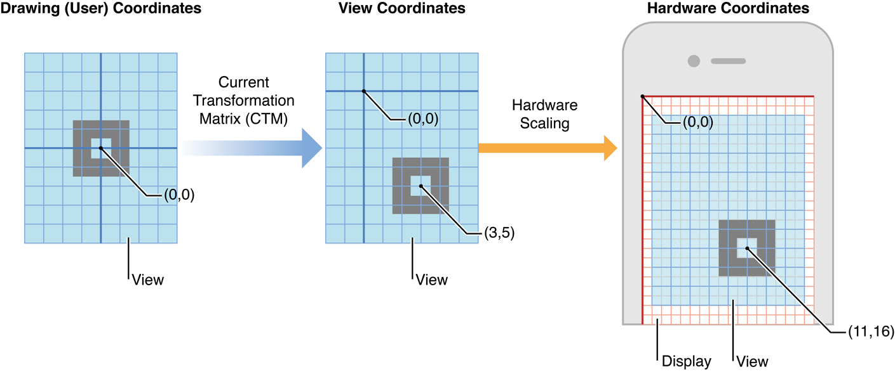
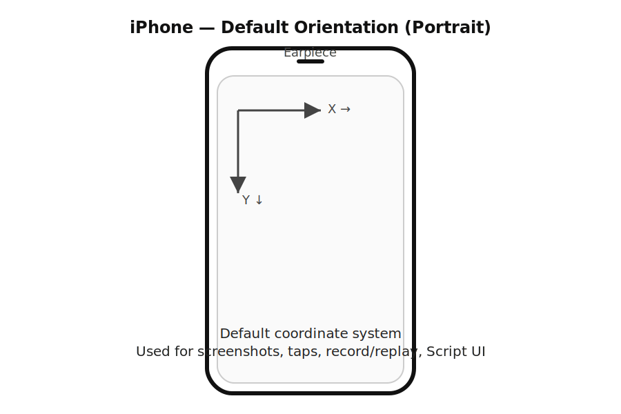
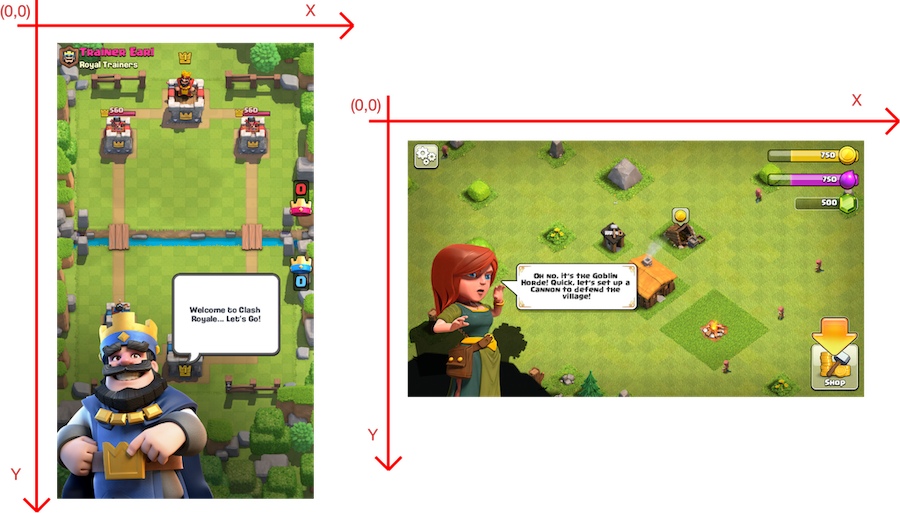

# 屏幕坐标系

请先将设备的 **屏幕方向锁** 关闭，保持听筒在上，将设备 **竖直** 握持。其坐标系如下图 `Hardware Coordinates` 所示：

XXTouch Elite 始终以物理像素为单位，使用硬件分辨率坐标系，即 `Hardware Coordinates`，而不是逻辑分辨率坐标系 `Logical Coordinates` 或者视图坐标系 `View Coordinates`。有关不同设备的坐标系，请参阅：

- [iOS Resolution](https://www.ios-resolution.com/)
- [iOS Design Cheat Sheet](https://kapeli.com/cheat_sheets/iOS_Design.docset/Contents/Resources/Documents/index)
- [The Ultimate Guide To iPhone Resolutions](https://www.paintcodeapp.com/news/ultimate-guide-to-iphone-resolutions)

## 设备默认方向与受影响的模块

本章所述均基于硬件分辨率坐标系（物理像素）。此外，XXTouch Elite 针对不同设备规定了默认方向，影响常见功能对坐标的解释方式。

### 默认方向

出于历史原因，本文档中出现的 “HOME 键在下” 等说法，均可理解为对应设备的默认方向；同理，“HOME 键在左/右/上” 等描述也分别指代与之对应的方向约定。

iPhone：竖直向上（Portrait）。该默认方向适用于屏幕截取、模拟点击、录制回放和脚本 UI 等操作。

iPad：正对屏幕，充电接口位于右侧（横屏向右）为默认方向。

### 影响范围

- 屏幕相关操作：截图、区域裁剪、取色与图像识别等，若未显式修改，将按默认方向解析坐标。
- 触控交互：点击、滑动等手势坐标；录制的轨迹会在默认方向下回放。
- 录制与回放：手势路径以硬件坐标存储，除非重新配置，否则按默认方向执行。
- 脚本 UI 与覆盖层：使用绝对屏幕坐标的 UI/Overlay 组件遵循相同的方向规则。
- 图像/模板复用：在某一方向下制作的模板/截图，应在相同方向下使用；或通过 `screen.init` 进行旋转/归一化。

### 在脚本中切换坐标系

如需调整，请使用 [`screen.init`](../screen.md#初始化旋转坐标系-screeninit) 在脚本中显式设定工作坐标系。底层仍以硬件像素运作。建议在脚本开头明确设置预期方向。

