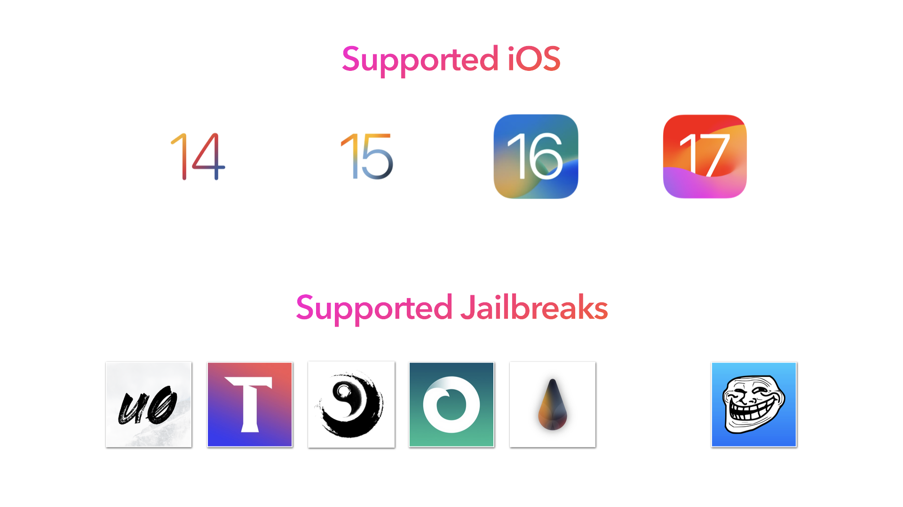
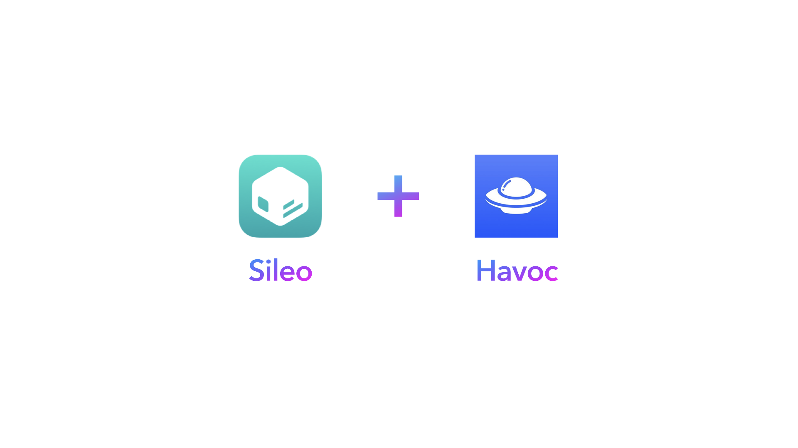

# 简介

XXTouch Elite 是一个功能强大且灵活的工具，允许你为设备创建自定义自动化脚本。通过 XXTouch Elite，你可以自动化重复性任务、控制智能家居设备等等。

XXTouch Elite 使用 [Lua](https://www.lua.org/) (v5.3) 作为脚本语言，这是一种轻量且**易学**的编程语言。Lua 以其简单性和灵活性著称，是自动化任务的理想选择。

本文档将指导你如何开始使用 XXTouch Elite，包括安装、配置和编写你的第一个脚本。无论你是初学者还是经验丰富的程序员，都能在这里找到开始使用 XXTouch Elite 自动化设备所需的一切。

## 前置条件

- XXTouch Elite 设计用于运行 iOS 14 及以上版本的 iPhone 或 iPad。
- XXTouch Elite 支持两种安装方式：[越狱](https://ios.cfw.guide/types-of-jailbreak/) 或 [TrollStore](https://ios.cfw.guide/installing-trollstore)（在受支持的设备/系统上）。以下越狱方法已支持并测试：
  - [unc0ver](https://unc0ver.dev/)
  - [Taurine](https://taurine.app/)
  - [Palera1n](https://palera.in/)（Rootless）
  - [Dopamine](https://ellekit.space/dopamine/)（Rootless 和 RootHide）
- 支持 TrollStore 环境的版本称为 **XXTouch Elite TS**，以下是一个详细的兼容性表格，请务必在购买和安装前仔细阅读：

  | 系统版本   | XXTouch Elite  | XXTouch Elite TS |
  | --------- | -------------- | ---------------- |
  | iOS 14.x  | ✅             | ❌               |
  | iOS 15.x  | ✅             | ✅               |
  | iOS 16.x  | ✅             | ✅               |
  | iOS 17.0  | ❌             | ✅               |

## 安装

1. 从 Havoc 源购买 “[XXTouch Elite](https://havoc.app/package/xxtouchelite)”。
2. 从 Sileo 包管理器安装 “XXTouch Elite”。
3. 安装后可能需要重启设备。

如果你使用 TrollStore，请在受支持的设备上使用隔空投送 AirDrop 或其他方式分享 `.tipa` 安装包到设备上，选择 “TrollStore” 进行安装。

## 更新 XXTouch Elite 版本

通过在 Sileo 中检查更新保持 XXTouch Elite 的最新版本。你也可以在 Sileo 设置中启用自动更新。

## 遇到问题？

在我们的 [GitHub 仓库](https://github.com/OwnGoalStudio/XXTouchElite/issues) 提问或加入我们的 [Discord 服务器](https://discord.gg/RTyMX6c9)。我们很乐意帮助你解决使用 XXTouch Elite 时遇到的任何问题。
