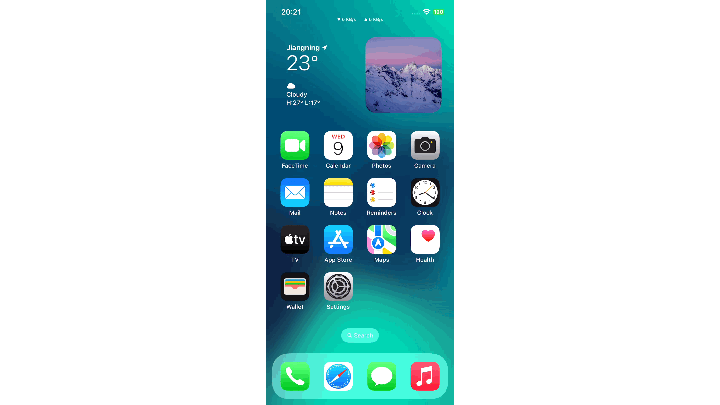

# 做一些笔记

现在我们已经准备好开始开发脚本了。你可以使用网页界面来创建和编辑脚本，并实时测试它们。

在本教程中，我们将创建一个简单的脚本，该脚本将在你的设备上打开 “备忘录” 应用，创建一个新笔记，并写下开发者社区中最著名的一句话：`Hello, World!`。

## 创建新脚本

让我们从创建一个新脚本开始。点击页面右上角的 “新建脚本” 按钮。为你的脚本输入一个名称，例如 `my-awesome-script.lua`。


## 打开 “备忘录”

我们需要做的第一件事是打开 “备忘录” 应用。为此，我们将使用 [`app.run`](../lua-manual/app.md#运行-app-apprun) 函数。[`app.run`](../lua-manual/app.md#运行-app-apprun) 函数接受一个字符串作为参数，该字符串是我们想要打开的应用的包标识符。在我们的例子中，我们想要打开 “备忘录” 应用，因此我们将使用字符串 `"com.apple.mobilenotes"`。

```lua
nLog("Open Notes...")
app.run("com.apple.mobilenotes")
```

请注意，[`nLog`](../lua-manual/appendix/logging-facilities.md#nlog) 函数用于将消息记录到控制台。这对于调试和测试你的脚本非常有用。

点击页面右下角的 “播放” 按钮运行脚本。你应该会看到 “备忘录” 应用在你的设备上打开。


:::info
在 “X.X.T.E.” 应用中，从 “更多” → “应用列表” 中找到应用的包标识符。
:::

## 找到 “新建笔记” 按钮

现在我们已经打开了 “备忘录” 应用，我们需要找到 “新建笔记” 按钮。为此，我们将使用 [`screen.find_color`](../lua-manual/screen.md#-多点相似度模式找色-screenfind_color) 函数。[`screen.find_color`](../lua-manual/screen.md#-多点相似度模式找色-screenfind_color) 函数接受一个颜色表作为参数，这是我们想要找到的颜色样本的集合。


在侧边栏中打开 “颜色选择器”，找到 “新建笔记” 按钮并点击它。这将把颜色样本添加到颜色表中。你需要添加更多颜色样本以增加找到按钮的可能性。


从 `find_color` 函数中复制生成的代码并粘贴到你的脚本中：

```lua
local x, y
while x == nil do
    nLog("Find “New Note” button…")
    sys.sleep(1)
    -- Generated code
    x, y = screen.find_color({
        {1056,2341,0xe4af0a},
        {1057,2388,0xe4af0a},
        {1105,2389,0xe4af0a},
        {1079,2366,0xe4af0a},
        {1106,2339,0xe4af0a},
        {1113,2332,0xe4af0a},
    },95,0,0,0,0)
end

nLog("Tap “New Note”…")
touch.tap(x, y)
sys.sleep(2)
```

这里我们向颜色表中添加了 6 个颜色样本。使用 `while ... do` 循环不断搜索按钮，直到找到为止。[`sys.sleep(1)`](../lua-manual/sys.md#-秒级延迟-syssleep) 函数用于在再次搜索之前暂停脚本 1 秒。

[`screen.find_color`](../lua-manual/screen.md#-多点相似度模式找色-screenfind_color) 函数返回按钮的坐标（如果找到），或者返回 `nil`（如果未找到）。我们将使用这些坐标与 [`touch.tap`](../lua-manual/touch.md#模拟手指轻触一次屏幕-touchtap) 一起点击按钮。

:::tip
制作颜色样本并不容易。以下是一些实用技巧：

1. **选择不同的颜色**。不同的颜色使搜索更具唯一性。
2. **避免图形边缘**。由于抗锯齿效果，边缘上的颜色变化很大。
3. **保持分散**。采样点应分散开来，以覆盖你想要定位的区域中的更多空间。

:::

## 输入 “Hello, World!”

向 “备忘录” 应用发送文本是最简单的部分。我们可以使用 [`key.send_text`](../lua-manual/key.md#模拟键入文本-keysend_text) 函数向应用发送文本。[`key.send_text`](../lua-manual/key.md#模拟键入文本-keysend_text) 函数接受一个字符串作为参数，这是我们想要发送的文本。

```lua
nLog("Enter text…")
key.send_text("Hello, world!")
```

点击页面右下角的 “播放” 按钮运行脚本。



## 点击 “完成”

最后，我们需要点击 “完成” 按钮以保存笔记。我们可以使用 [`screen.ocr_text`](../lua-manual/screen.md#-屏幕光学字符识别-screenocr_text) 函数找到 “完成” 按钮，然后使用 [`touch.tap`](../lua-manual/touch.md#模拟手指轻触一次屏幕-touchtap) 点击它。这部分有点棘手，因为文本容易受到字体和大小的影响，因此我们需要使用 OCR（光学字符识别）来找到它。

**以下是我们的最终脚本：**

```lua
nLog("Open “Notes”…")
app.run("com.apple.mobilenotes")

local x, y
while x == nil do
    nLog("Find “New Note” button…")
    sys.sleep(1)
    x, y = screen.find_color({
        {1056,2341,0xe4af0a},
        {1057,2388,0xe4af0a},
        {1105,2389,0xe4af0a},
        {1079,2366,0xe4af0a},
        {1106,2339,0xe4af0a},
        {1113,2332,0xe4af0a},
    },95,0,0,0,0)
end

nLog("Tap “New Note”…")
touch.tap(x, y)

nLog("Enter text…")
sys.sleep(2)
key.send_text("Hello, world!")

local function tapWord(word)
  local txts, details = screen.ocr_text {}
  local tapped = false
  for i, v in ipairs(txts) do
    if v == word then
      touch.tap(details[i].center[1], details[i].center[2])
      tapped = true
    end
  end
  return tapped
end

nLog("Tap “Done”…")
while not tapWord("Done") do
    sys.sleep(1)
end
```
