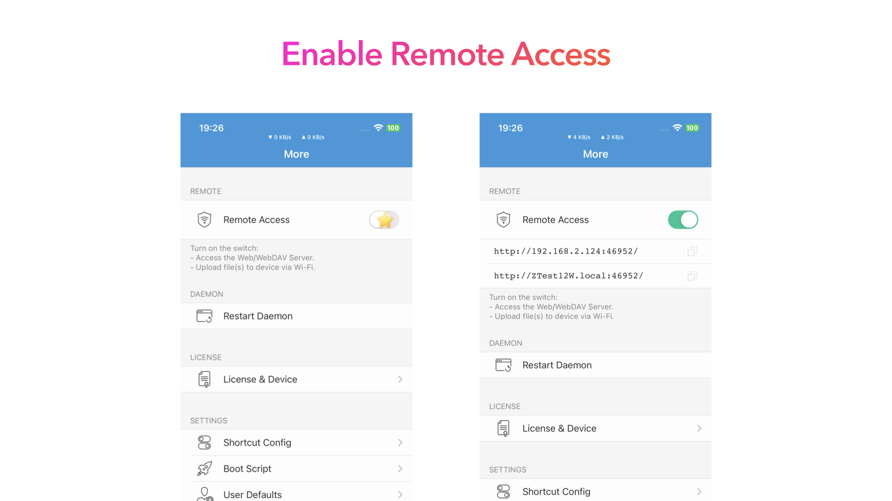
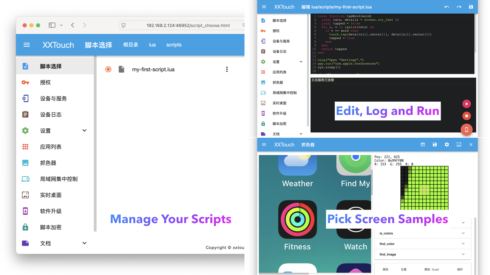

# 准备开发

要开始脚本开发，你需要一台安装了 Safari 或 Chrome 的笔记本电脑或台式电脑。

## 启用远程访问

为了保护你的设备免受未经授权的访问，你需要在 “X.X.T.E.” 应用中启用远程访问。



## 从网页浏览器访问

然后，你可以通过在网页浏览器中输入以下 URL 来访问你的脚本：

```txt
http://<ip_address>:46952
```

其中 `<ip_address>` 是你的设备的 IP 地址，`46952` 是 XXTouch Elite 的默认端口号。


