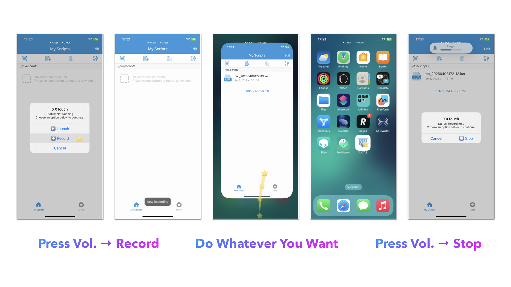
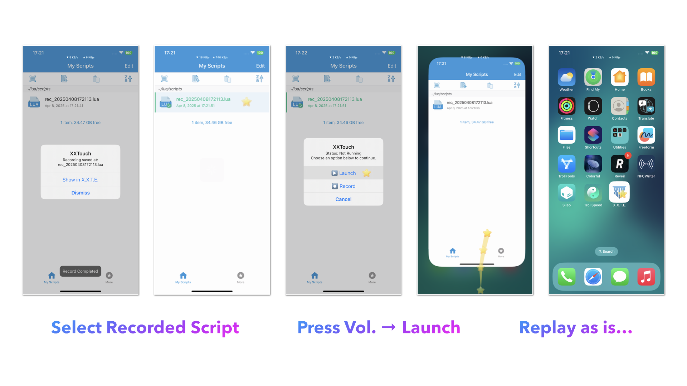
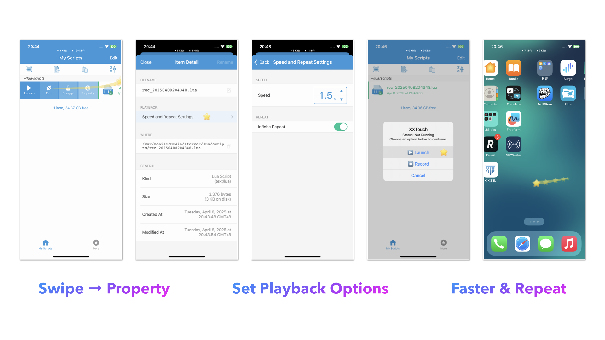

# Record and Replay

Press physical volume buttons to record and replay your actions.

You can customize the behaviors of the volume buttons in “More” → “Shortcut Config”.

## How to Record

1. Press volume button and select “Record”.
2. Do whatever you want…
3. Press volume button again and select “Stop”.

## How to Replay

1. Select any script.
2. Press volume button and select “Launch”.

## Playback Options

You can customize the playback speed and the number of loops for recorded scripts.

1. Slide the script to the right and click the “Property” button.
2. Tap “Speed and Repeat Settings”.
3. Set the playback speed and the number of loops (or infinite).
4. Press volume button and select “Launch”.

