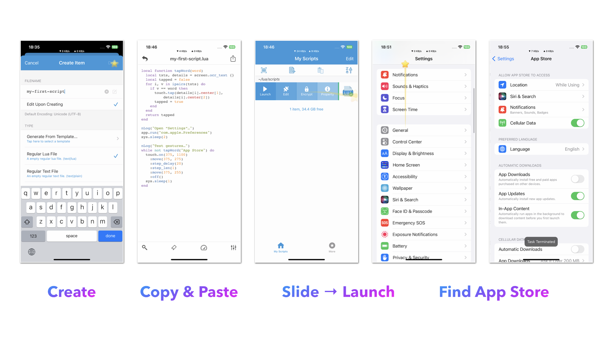

# 运行自定义脚本

运行录制的脚本很棒，但它可能无法应对现实场景中可能发生的所有情况。因此，创建一个可以处理不同情况的脚本非常重要。

现在我们为你编写了一个脚本，帮助你入门。这个脚本将打开 “设置”，向下滚动找到 “App Store” 选项并点击它。

```lua
local function tapWord(word)
  local txts, details = screen.ocr_text {}
  local tapped = false
  for i, v in ipairs(txts) do
    if v == word then
      touch.tap(details[i].center[1], details[i].center[2])
      tapped = true
    end
  end
  return tapped
end

nLog("Open “Settings”…")
app.run("com.apple.Preferences")
sys.sleep(2)

nLog("Test gestures…")
while not tapWord("App Store") do
  touch.on(375, 1100)
    :move(375, 275)
    :step_delay(20)
    :step_len(1)
    :move(375, 255)
    :off()
  sys.sleep(1)
end
```

## 找到 App Store

你可以按照以下步骤运行上述脚本：

1. 创建一个名为 `my-first-script.lua` 的新 Lua 脚本文件。
2. 将上述代码复制并粘贴到文件中，然后保存。
3. 向右滑动脚本并点击“启动”按钮。


