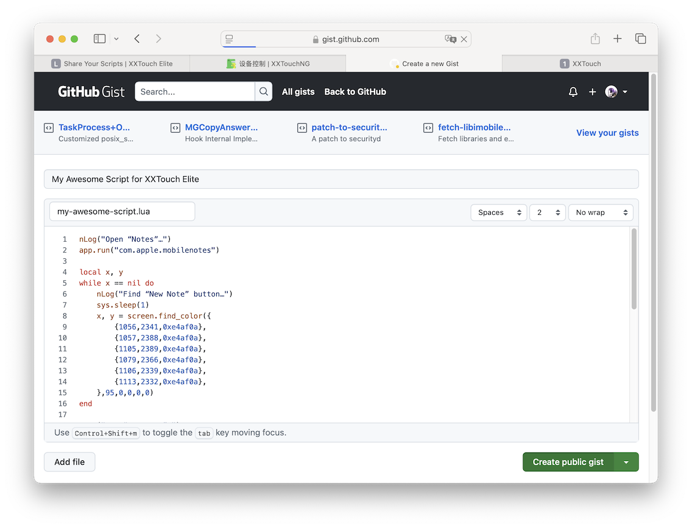
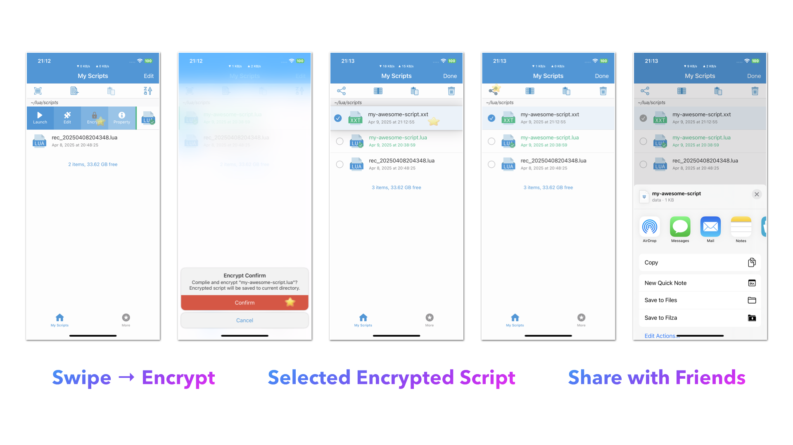
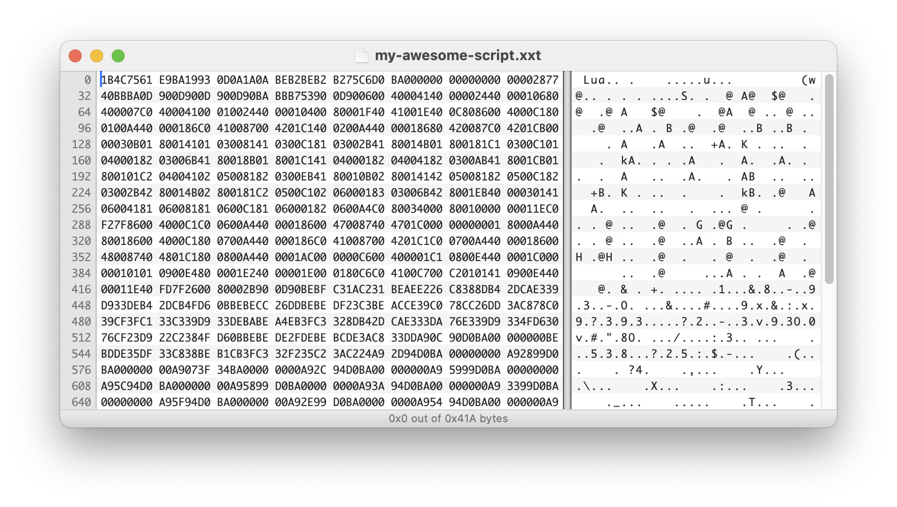

# Share Your Scripts

Now that you have created your first script, you can share it with the world! You can do this by uploading your lua script as a public [gist on GitHub](https://gist.github.com). This will allow others to see your code and even contribute to it.

## Encrypt Your Script

What if you want to share your script but don’t want others to see your code? You can encrypt your script using the “Encrypt” action. This will create a new file with the same name as your original script, but with `.xxt` file extension appended to the end. You can then share this file with others, and they will be able to run it without seeing or modifying the code.

:::warning
Encrypted scripts are compiled to **byte codes** with a modified `luac` compiler, which means they are not 100% secure. However, it is still a good way to obfuscate your code and prevent others from easily modifying it.
:::

